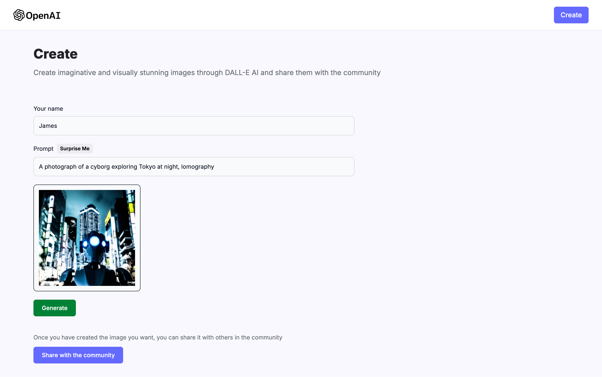
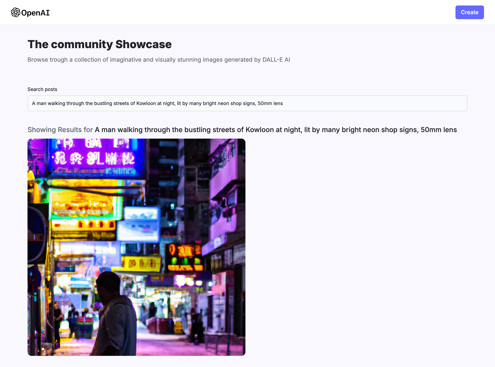

# AI Image Generator

This project is an **AI-powered image generation platform** developed as a learning project using the MERN stack.  
It allows users to **create images using AI**, share them with the community, download them and browse all user-generated images.

## 🖼️ Screenshots / Demo

### Home Screen


### Create AI Image Screen




### Search Screen



---

## 🎯 Project Objectives

The main goals of this project are to:

- Generate images from user prompts using **OpenAI's DALL-E model**
- Store and fetch user-generated images using **MongoDB**
- Enable users to **share images with the community**
- Implement a **responsive and modern UI** using Tailwind CSS
- Practice working with the **MERN stack** and integrating AI APIs

---

## 🛠️ Technologies & Libraries Used

- **React.js** – Frontend framework
- **Node.js & Express.js** – Backend server and API routes
- **MongoDB** – Database for storing user posts
- **Tailwind CSS** – Styling and responsive design
- **OpenAI (DALL-E)** – AI image generation
- **Cloudinary** – Cloud-based image storage

---

## 💡 Features

- HomePage: Browse all images shared by the community
- Create Post Page: Generate images with AI based on user prompts
- Share images with other users
- Search images by prompt or username
- Download generated images
- Responsive and modern UI

---

## 🔑 Required API Keys & Environment Variables

To use this project, you need to set up several environment variables:

1. **OpenAI API Key** – for AI image generation

   - Go to [OpenAI API](https://platform.openai.com/account/api-keys), sign up or log in, and generate an API key

2. **Cloudinary credentials** – for storing and serving images

   - `CLOUDINARY_CLOUD_NAME`
   - `CLOUDINARY_API_KEY`
   - `CLOUDINARY_API_SECRET`
   - Sign up at [Cloudinary](https://cloudinary.com/) to get these

3. **MongoDB URL** – for storing user posts
   - `MONGODB_URL`
   - Create a MongoDB cluster at [MongoDB Atlas](https://www.mongodb.com/cloud/atlas) and get the connection string

---

## 🚀 Getting Started

Follow these steps to run the project locally:

### Installation

1. Clone the repository:

```bash
git clone https://github.com/andref218/ai_image_generator.git
cd ai_image_generator
```

2. Install dependencies for both server and client:

# Server

```bash
cd server
npm install
```

# Client

```bash
cd ../client
npm install
```

3. Setup environment variables:
   Create a `.env` file in ther server folder:

```env
OPENAI_API_KEY=your_openai_api_key_here
MONGODB_URL=your_mongodb_connection_string_here
CLOUDINARY_CLOUD_NAME=your_cloudinary_name
CLOUDINARY_API_KEY=your_cloudinary_api_key
CLOUDINARY_API_SECRET=your_cloudinary_api_secret
```

5. Run the development servers:
   **Keep both terminals open while the servers are running.**

# Server

```bash
cd server
npm start
```

# Client

```bash
cd ../client
npm run dev
```
